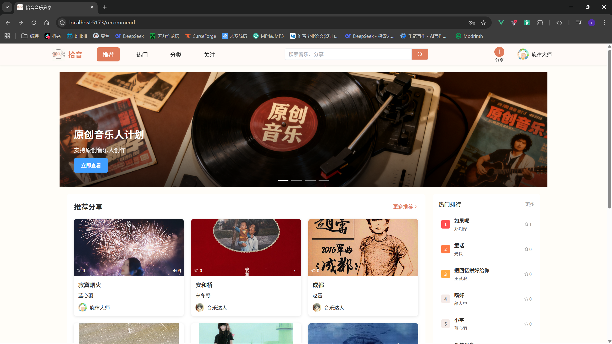
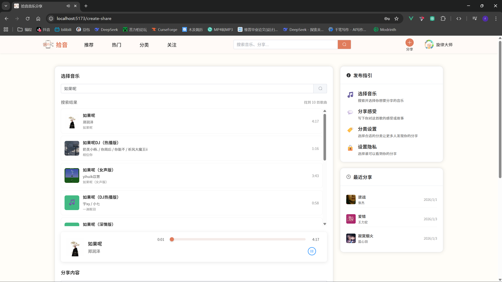
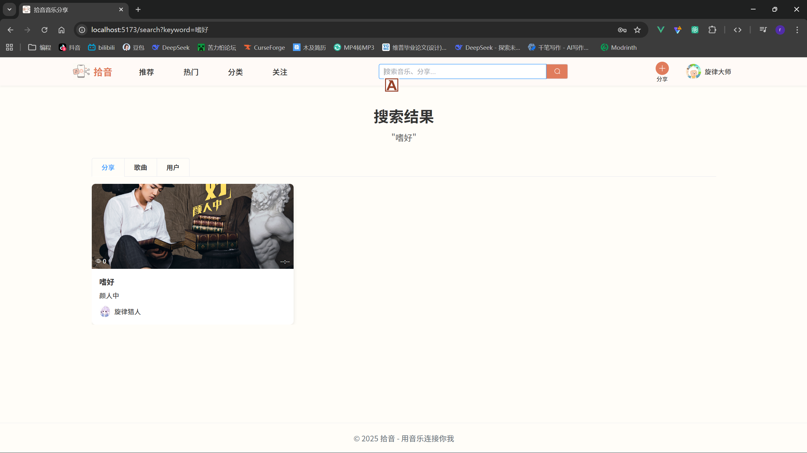

## Music Share

一个基于 **Vue 3 + Spring Boot** 的音乐分享平台：分享/浏览音乐动态、点赞评论、关注用户，并提供在线播放与音乐搜索体验。







### 项目概览

- **前端**：`music-share-frontend`（Vite + Vue3 + Element Plus + Pinia）
- **后端**：`music-share-backend`（Spring Boot + Spring Security + JWT + JPA）
- **音乐数据来源（前端）**
  - **搜索/专辑封面**：通过 **Vite 代理**转发到 `music.163.com`（开发环境下生效）
  - **播放 URL/歌单等**：使用第三方 `meting` 接口（见 `music-share-frontend/src/api/netease.js`）

> 仓库中有 `music-share-backend/NeteaseCloudMusicApi/` 目录，但当前仅保留 `README.MD/package-lock.json`，**不包含可运行服务**，也不会被本项目启动流程使用。

## 技术栈

### 前端

- **框架**：Vue 3
- **构建工具**：Vite
- **UI**：Element Plus
- **状态管理**：Pinia
- **路由**：Vue Router
- **网络请求**：Axios / Fetch
- **代码规范**：ESLint + Prettier

### 后端

- **框架**：Spring Boot 3.2.0
- **数据库**：MySQL 8（默认配置），依赖中包含 H2（runtime）
- **ORM**：Spring Data JPA
- **安全**：Spring Security + JWT
- **构建工具**：Maven

## 功能特性

### 用户功能
- 用户注册和登录（JWT 认证）
- 个人资料管理
- 关注/取消关注用户
- 查看用户主页和分享历史

### 音乐分享
- 创建音乐分享（支持搜索和选择歌曲）
- 管理个人分享
- 查看分享详情
- 批量导入分享数据

### 社交互动
- 点赞分享
- 评论分享
- 查看关注列表

### 音乐发现
- 搜索歌曲、分享和用户
- 查看热门推荐
- 浏览分类音乐
- 在线播放音乐

### 其他功能
- 轮播图展示
- 响应式设计
- 播放器控制（播放/暂停、进度条拖动）

## 项目结构

```
MusicShare/
├── music-share-frontend/          # 前端项目
│   ├── public/                    # 静态资源
│   ├── src/
│   │   ├── api/                  # API 接口
│   │   ├── assets/               # 资源文件
│   │   ├── components/           # 组件
│   │   ├── router/               # 路由配置
│   │   ├── stores/               # 状态管理
│   │   ├── views/                # 页面组件
│   │   ├── App.vue               # 根组件
│   │   └── main.js               # 入口文件
│   ├── package.json
│   └── vite.config.js
├── music-share-backend/          # 后端项目
│   ├── NeteaseCloudMusicApi/     # 仅保留说明文件（不含可运行服务）
│   ├── src/main/java/com/fangyuan/musicsharebackend/
│   │   ├── config/              # 配置类
│   │   ├── controller/          # 控制器
│   │   ├── dto/                 # 数据传输对象
│   │   ├── entity/              # 实体类
│   │   ├── exception/           # 异常处理
│   │   ├── filter/              # 过滤器
│   │   ├── repository/          # 数据访问层
│   │   ├── service/             # 业务逻辑层
│   │   └── util/                # 工具类
│   ├── src/main/resources/
│   │   └── application.properties
│   └── pom.xml
└── README.md
```

## 环境要求

### 前端
- Node.js ^20.19.0 || >=22.12.0
- npm 或 yarn

### 后端
- JDK 17
- Maven 3.6+
- MySQL 8.0+

## 快速开始（本地开发）

### 1. 克隆项目

```bash
git clone <repository-url>
cd MusicShare
```

### 2. 配置数据库

创建 MySQL 数据库：

```sql
CREATE DATABASE music_share CHARACTER SET utf8mb4 COLLATE utf8mb4_unicode_ci;
```

### 3. 配置后端

编辑 `music-share-backend/src/main/resources/application.properties`：

```properties
# 数据库配置
spring.datasource.url=jdbc:mysql://localhost:3306/music_share?useSSL=false&allowPublicKeyRetrieval=true&serverTimezone=UTC&charset=utf8mb4&useUnicode=true
spring.datasource.username=root
spring.datasource.password=your_password

# JWT 配置
jwt.secret=your_jwt_secret_key_change_this_in_production
jwt.expiration=2592000000
```

> 注意：仓库当前的 `application.properties` 里可能包含示例密码（如 `123456`），请务必按你的本机环境修改；生产环境不要把真实密钥/密码提交到仓库。

### 4. 启动后端

```bash
cd music-share-backend
./mvnw spring-boot:run
```

后端服务将在 `http://localhost:8080` 启动

> Windows 可用：`mvnw.cmd spring-boot:run`

### 5. 启动前端

```bash
cd music-share-frontend
npm install
npm run dev
```

前端服务将在 `http://localhost:5173` 启动

### 6. 默认测试账号（后端启动后自动初始化）

后端 `DataInitializer` 会在数据库中创建若干测试用户（若不存在则创建）：

- **手机号**：`13812345678` / `13912345678` / `13712345678` / `13612345678` / `13512345678`
- **密码**：`123456`

## API 接口

### 后端 API（以 `http://localhost:8080` 为例）

#### 认证

- `POST /api/auth/register`：注册
- `POST /api/auth/login`：登录
- `POST /api/auth/logout`：注销
- `GET /api/auth/check`：检查登录状态
- `GET /api/auth/userinfo`：获取当前登录信息（简版）

#### 用户

- `GET /api/user/info`：获取当前用户信息
- `POST /api/user/avatar`：上传头像（`multipart/form-data`，需要 `Authorization: Bearer <token>`）
- `GET /api/user/search?keyword=xxx`：搜索用户
- `GET /api/user/{userId}`：获取用户信息
- `GET /api/user/top?limit=5`：热门用户

#### 分享

- `GET /api/shares`：分享列表（会按隐私过滤）
- `GET /api/shares/{id}`：分享详情（会按隐私过滤）
- `GET /api/shares/search?keyword=xxx`：搜索分享（会按隐私过滤）
- `GET /api/shares/user`：当前用户分享（需要登录）
- `GET /api/shares/user/{userId}`：指定用户分享（会按隐私过滤）
- `POST /api/shares`：创建分享（需要登录）
- `PUT /api/shares/{id}`：更新分享（需要登录且为作者）
- `POST /api/shares/delete/{id}`：删除分享（需要登录且为作者）

#### 评论

- `POST /api/comments`：创建评论（需要 `Authorization`）
- `GET /api/comments/share/{shareId}`：评论列表
- `DELETE /api/comments/{commentId}`：删除评论（需要 `Authorization`）
- `GET /api/comments/count/{shareId}`：评论数量

#### 点赞

- `POST /api/likes/{shareId}`：点赞（需要 `Authorization`）
- `DELETE /api/likes/{shareId}`：取消点赞（需要 `Authorization`）
- `GET /api/likes/check/{shareId}`：点赞状态（需要 `Authorization`）
- `GET /api/likes/user`：我点赞的分享（需要 `Authorization`）

#### 收藏

- `POST /api/collections/{shareId}`：收藏（需要 `Authorization`）
- `DELETE /api/collections/{shareId}`：取消收藏（需要 `Authorization`）
- `GET /api/collections/check/{shareId}`：收藏状态（需要 `Authorization`）
- `GET /api/collections/user`：我的收藏（需要 `Authorization`）

#### 关注

- `POST /api/follows/{userId}`：关注（需要 `Authorization`）
- `DELETE /api/follows/{userId}`：取消关注（需要 `Authorization`）
- `GET /api/follows/check/{userId}`：关注状态（需要 `Authorization`）
- `GET /api/follows/followings`：我的关注列表（需要 `Authorization`）
- `GET /api/follows/followers`：我的粉丝列表（需要 `Authorization`）
- `GET /api/follows/followings/{userId}`：指定用户关注列表
- `GET /api/follows/followers/{userId}`：指定用户粉丝列表
- `GET /api/follows/count/following/{userId}`：关注数
- `GET /api/follows/count/follower/{userId}`：粉丝数

#### 文件上传/访问

- `POST /api/file/upload`：上传图片（`file` + `type`，默认 `temp`）
- `DELETE /api/file/delete/{type}/{filename}`：删除文件
- `GET /uploads/**`：静态访问上传文件（由 `file.upload-dir` 映射）

#### 轮播图

- `GET /api/banners`：获取轮播图

#### 批量导入（开发/测试用）

- `POST /api/share-batch/import?count=10`：批量导入分享
- `GET /api/share-batch/count`：分享总数
- `POST /api/share-batch/delete-all`：删除所有分享

### 音乐搜索/播放（前端）

- **搜索**：开发环境通过 `Vite proxy` 将 `/api/netease/**` 转发到 `music.163.com`（见 `music-share-frontend/vite.config.js`）
- **播放 URL/歌单**：使用第三方 `meting` 接口（见 `music-share-frontend/src/api/netease.js`）

> 生产环境如果仍要使用 `/api/netease`，需要在 Nginx/网关层做同等反向代理与请求头注入（Referer/Origin/User-Agent），否则浏览器会遇到跨域或访问限制。

## 开发指南

### 前端开发

```bash
cd music-share-frontend

# 安装依赖
npm install

# 启动开发服务器
npm run dev

# 构建生产版本
npm run build

# 代码检查
npm run lint

# 代码格式化
npm run format
```

### 后端开发

```bash
cd music-share-backend

# 编译项目
./mvnw clean compile

# 运行测试
./mvnw test

# 打包项目
./mvnw clean package
```

## 配置说明

### 前端配置

- 后端 API BaseURL：`music-share-frontend/src/api/request.js`（默认写死为 `http://localhost:8080/api`）
- 网易云代理：`music-share-frontend/vite.config.js` 中的 `/api/netease` 代理仅在 `npm run dev` 时生效

### 后端配置

主要配置项在 `application.properties`：

- **数据库配置**: 数据库连接、用户名、密码
- **JPA 配置**: 数据库方言、DDL 策略、SQL 日志
- **JWT 配置**: 密钥、过期时间
- **日志配置**: 日志级别
- **文件上传目录**: `file.upload-dir`（未配置时默认 `uploads`，并映射到 `/uploads/**`）

## 常见问题

### 1. 数据库连接失败

检查 MySQL 服务是否启动，数据库配置是否正确。

### 2. 前端无法连接后端

确保后端服务已启动，检查 CORS 配置。

### 3. 音乐无法播放
检查 `music-share-frontend/src/api/netease.js` 中的第三方接口是否可用；若你依赖 `/api/netease` 的搜索能力，请确认开发代理或生产反向代理已正确配置。

## 贡献指南

欢迎提交 Issue 和 Pull Request！

## 许可证

MIT License

## 联系方式

qq：2035978723
